<section>
# Sandbox


</section>

<section>
# Git

## Part 1
</section>

<section>
# Configuring
<section>

Первоначальная настройка **Git**

```shell
git config --global user.name "Nikolay Rozhkov"
git config --global user.email rozhkov@uchi.ru
```
</section>

<section>
External **diff**

```ini
[diff]
  tool = meld
[difftool]
  path = meld
  prompt = false
```
External **editor**

```ini
[core]
  editor = subl -n -w
```
</section>

<section>
**Init**

Инициализировать новый проект c **Git**

```bash
git init new-project
git init new-project --bare
```

Добавить существуй проект в **Git**

```shell
cd existing-project
git init
git init .
```
</section>
</section>

<section>
# Staging

<section>
**Add**

```shell
git add .
```

**Reset**
```shell
git reset
```
**Remove**

```shell
git rm
git add -A
git add --all
```
</section>

<section>
## Commit

```shell
git status
git commit
```

```shell
git commit -m 'Here goes message'
```
</section>

<section>
## Undo

Изменение последнего коммита

```shell
git commit --amend
```

Отмена изменений файла

```shell
git checkout -- hello.txt
```
</section>

<section>

</section>
</section>

<section>
# Branches

<section>
Создание ветки

```shell
git branch feature
```

Переключение

```shell
git checkout feature
```

Сокращённо

```shell
git checkout -b feature
```
</section>

<section>
Список веток

```shell
$ git branch
* master
```

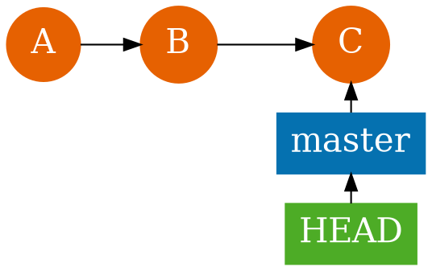
</section>

<section>
Новая ветка

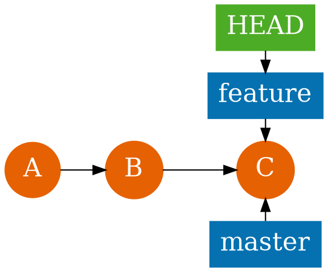
</section>

<section>
Разработка

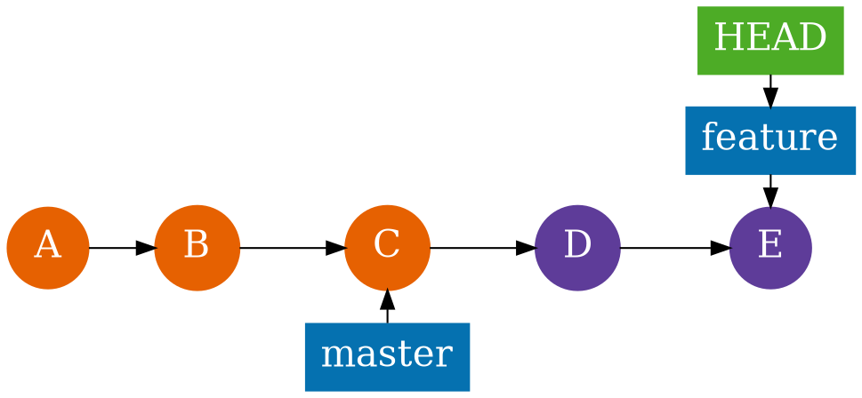
</section>

<section>
Слияние **fast-forward, "Перемотка"**

```shell
git checkout master
git merge feature
```

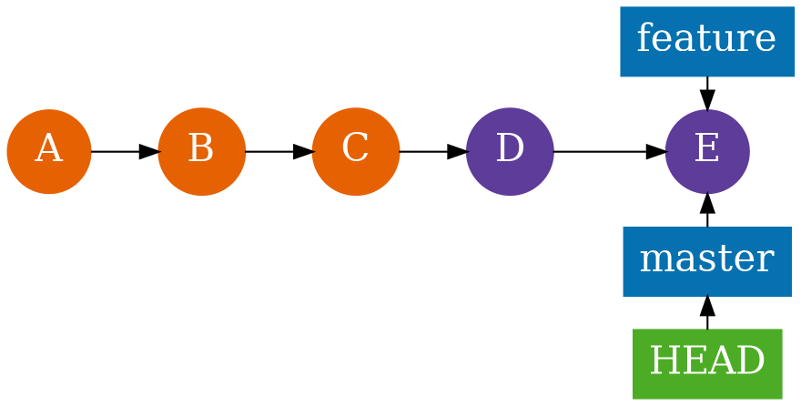
</section>

<section>
Слияние **--no-ff**

```shell
git checkout master
git merge --no-ff feature
```

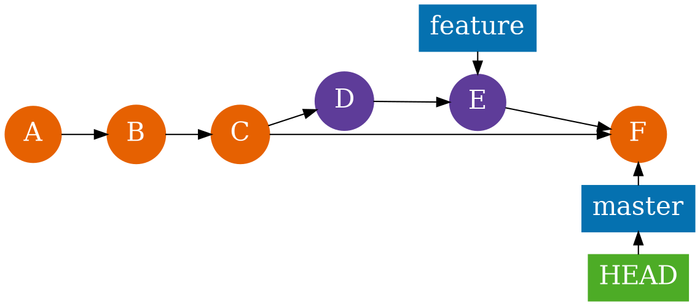
</section>

<section>
Слияние при наличии других коммитов

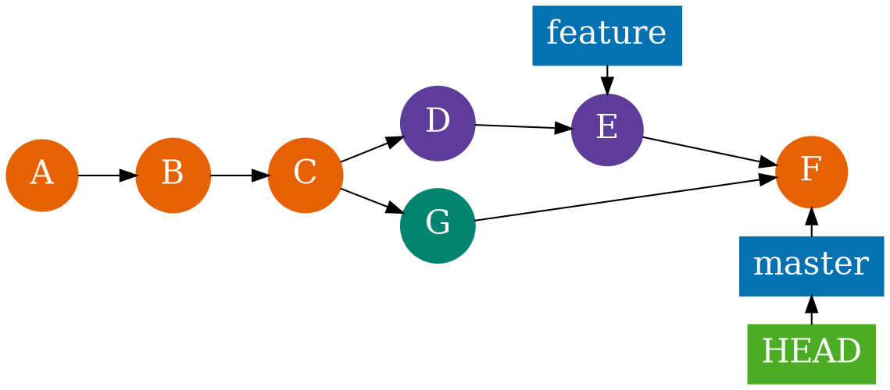
</section>

<section>

```
git checkout feature && git rebase master
```

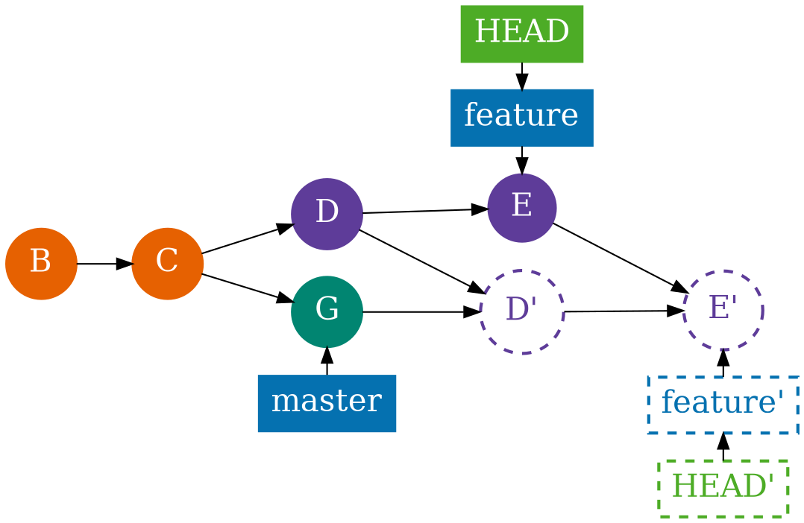
</section>

<section>

```shell
git cherry-pick cc9a7b9
```

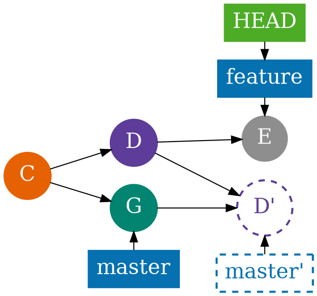
</section>

<section>
**Revert**


```shell
git revert HEAD~1
```

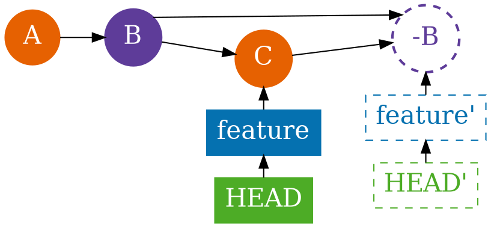
</section>

</section>

<section>
# Remotes

<section>

```shell
git init uchi && cd ..
```

<pre><code class="hljs nohighlight">git clone uchi<span class="fragment fade-up" data-fragment-index="0" style="color: #4dac26;"> -o source</span> local
cd local<span class="fragment fade-up" data-fragment-index="1" style="color: #5e3c99"> && git branch -m main</span>
<span class="fragment fade-out" data-fragment-index="3"><span class="fragment fade-up" data-fragment-index="2" style="color: #e66101">git branch --unset-upstream</span></span><span class="fragment fade-up" data-fragment-index="3" style="color: #0571b0">git branch --set-upstream-to=source/master</span>
cat .git/config</code></pre>

<pre><code class="hljs nohighlight">[remote "<span class="fragment fade-out" data-fragment-index="0">origin</span><span class="fragment fade-up" data-fragment-index="0" style="color: #4dac26;">source</span>"]
  url = /tmp/uchi
  fetch = +refs/heads/*:refs/remotes/<span class="fragment fade-out" data-fragment-index="0">origin</span><span class="fragment fade-up" data-fragment-index="0" style="color: #4dac26;">source</span>/*
[branch "<span class="fragment fade-out" data-fragment-index="1">master</span><span class="fragment fade-up" data-fragment-index="1" style="color: #5e3c99">main</span>"]
  <span class="fragment fade-out" data-fragment-index="2">remote = <span class="fragment fade-out" data-fragment-index="0">origin</span><span class="fragment fade-up" data-fragment-index="0" style="color: #4dac26;">source</span>
  merge = refs/heads/master</span><span class="fragment fade-up" data-fragment-index="3" style="color: #0571b0">remote = source
  merge = refs/heads/master</span></code></pre></span>

</section>

<section>

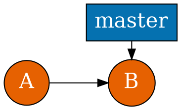

```
git clone uchi -o source local
```

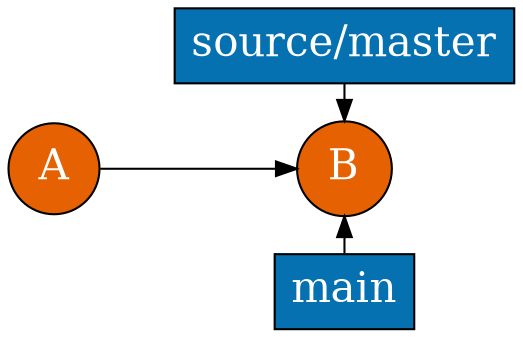
</section>

<section>

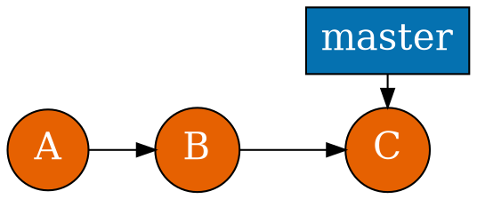

```shell
...
```

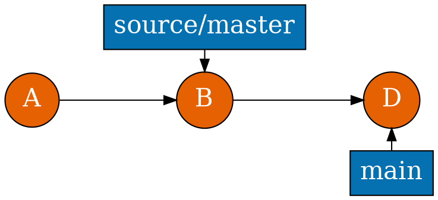
</section>

<section>


```shell
git fetch source
```

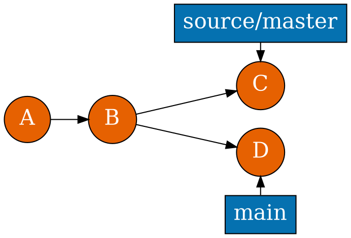
</section>


<section>


```shell
git fetch && git merge source/master
git pull source
```

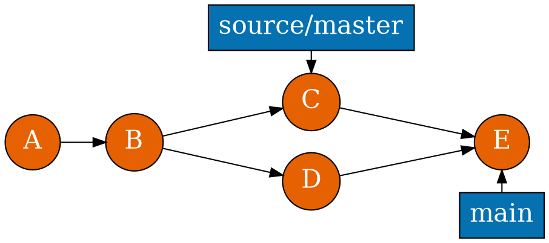
</section>

<section>
**Notation**

```shell
source:destination
git push origin :topic
git push origin --delete topic
```

</section>
</section>

<section>
# Git

## Part 2
</section>

<section>
# CHECKOUT

<section>
**Resolve conflicts**

```
git rebase master
git pull --rebase
```

```
git checkout --ours file.txt # feature
git checkout --theirs file.txt # master
```
</section>

<section>
**Detached**

```
git checkout 26c0aa12792e6344f5
```


```
git checkout 26c0aa12792e6344f5 -b feature
```
</section>
</section>

<section>
# Revisions

<section>


```bash
$ git show ???
```

</section>

<section>
Возможные значения

**master**

<p class="fragment">
**v1**
</p>

<p class="fragment">
**b1713c7**
</p>

</section>

<section>
Возможные значения

HEAD**@{**0**}**

<p class="fragment">
HEAD**^**
</p>

<p class="fragment">
HEAD**~**
</p>

</section>

<section>
Выбираем **SHA**

```shell
$ git log
commit b1713c78427b728a2d981981dccb5d6e398b66a6
Author: Nikolay Rozhkov <rozhkov@uchi.ru>
Date:   Wed Jun 21 19:20:54 2017 +0300

    Fixed env

commit 47194bcc4a1413360b42a15f1067605162f58d29
Author: vbratkev <bratkevich.v@gmail.com>
Date:   Tue Jun 20 15:15:26 2017 +0300

    Fix deploy
```

</section>

<section>
Выбираем перемещения **HEAD**

```shell
$ git reflog
b1713c7 HEAD@{0}: commit: Fixed env
47194bc HEAD@{1}: clone: from git@github.com:uchiru/ansible-south-africa.git
```

```shell
$ git show HEAD@{1}
```

</section>

<section>
Выбираем **родителей**

`HEAD^n` **n-й родитель**

<p class="fragment">
`HEAD~n` **n 1-x родителей**
</p>

<p class="fragment">
`HEAD^1^1 == HEAD~2`
</p>
</section>

<section>
Выбираем **родителей**

`HEAD^ == HEAD^1`

`HEAD~ == HEAD~1`

`HEAD  == HEAD^0 == HEAD~0`
</section>

<section>
Выбираем родителей

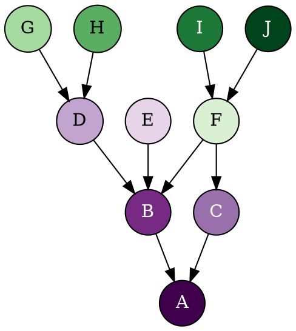

</section>

<section>
Выбираем родителей

```graphviz
digraph revisions {
  bgcolor="transparent"
  node [shape="box" fillcolor="#92B6E6" style="rounded,filled"]
  { G, H } -> D
  { I, J } -> F
  { D, E, F } -> B
  F -> C
  { B, C } -> A

  A, B, C, I, J[fontcolor="white"]

  A[fillcolor="#40004b" label="A = A^0"]
  B[fillcolor="#762a83" label="B = A^ = A^1 = A~1"]
  C[fillcolor="#9970ab" label="C = A^2 = A^2"]
  D[fillcolor="#c2a5cf" label="D = A^^ = A^1^1 = A~2"]
  E[fillcolor="#e7d4e8" label="E = B^2 = A^^2"]
  F[fillcolor="#d9f0d3" label="F = B^3 = A^^3"]
  G[fillcolor="#a6dba0" label="G = A^^^ = A^1^1^1 = A~3"]
  H[fillcolor="#5aae61" label="H = D^2 = B^^2 = A^^^2 = A~2^2"]
  I[fillcolor="#1b7837" label="I = F^ = B^3^ = A^^3^"]
  J[fillcolor="#00441b" label="J = F^2 = B^3^2 = A^^3^2"]
}
```

</section>
</section>

