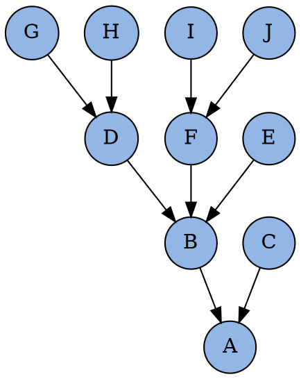

<section class="center">
# Init
</section>

<section>
# Init

<section>
Инициализировать новый проект c **Git**

```bash
git init trygit
```
</section>

<section>
Добавить существуй проект в **Git**

```bash
cd trygit
git init .
```
</section>
</section>


<section>
# Status
</section>

<section>
# Branch
</section>

<section>
# Checkout
</section>

<section>
# Mysterious signs


</section>