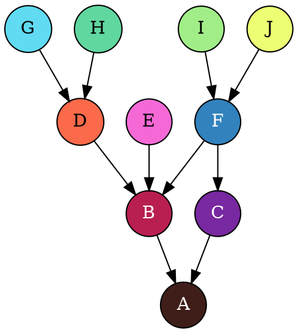
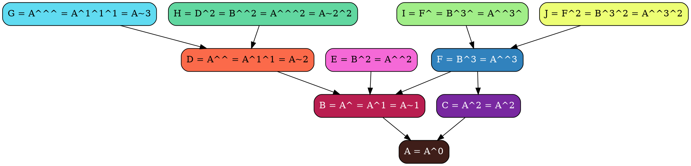

<section class="center">
# Revisions

<section>


```bash
$ git show ???
```

</section>

<section>

Возможные значения

<p class="fragment">
**master**
</p>

<p class="fragment">
**v1**
</p>

<p class="fragment">
**b1713c7**
</p>
</section>

<section>
Выбираем **SHA**

```shell
$ git log
commit b1713c78427b728a2d981981dccb5d6e398b66a6
Author: Nikolay Rozhkov <rozhkov@uchi.ru>
Date:   Wed Jun 21 19:20:54 2017 +0300

    Fixed env

commit 47194bcc4a1413360b42a15f1067605162f58d29
Author: vbratkev <bratkevich.v@gmail.com>
Date:   Tue Jun 20 15:15:26 2017 +0300

    Fix deploy
```

</section>

<section>

Возможные значения

HEAD**@{0}**

<p class="fragment">
HEAD**^**
</p>

<p class="fragment">
HEAD**~**
</p>

</section>

<section>

Выбираем перемещения **HEAD**

```shell
$ git reflog
b1713c7 HEAD@{0}: commit: Fixed env
47194bc HEAD@{1}: clone: from git@github.com:uchiru/ansible-south-africa.git
```

```shell
$ git show HEAD@{1}
```

</section>

<section>
Выбираем родителей



</section>

<section>
Выбираем родителей



</section>
</section>

<section class="center">
# Git
</section>

<section class="center">
# Init

<section>
Инициализировать новый проект c **Git**

```bash
git init trygit
```
</section>

<section>
Добавить существуй проект в **Git**

```bash
cd trygit
git init .
```
</section>
</section>

