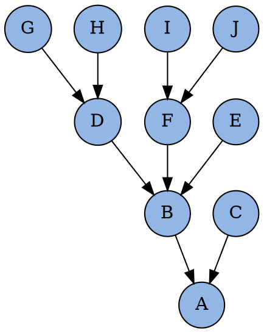

<section>
# Checkout

<section>
# Checkout
Переключиться в ветку
</section>

<p class="fragment">
Вытащить файл из ветки
</p>

<p class="fragment">
Вытащить файл
</p>

</section>

<section>
# Git
</section>

<section>
# Commit

```bash
git add .
git commit -m 'Changed everything'
```
</section>

<section>
# Revisions

## ~ ^

<p class="fragment">


</p>
</section>