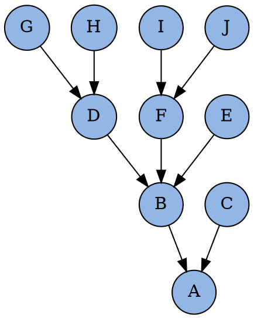

<section>
# GIT



```bash
digraph revisions {
  bgcolor="transparent"
  node [shape="circle" fillcolor="#92B6E6" style=filled]
  { G, H } -> D
  { I, J } -> F
  { D, E, F } -> B
  { B, C } -> A
}
```

</section>
