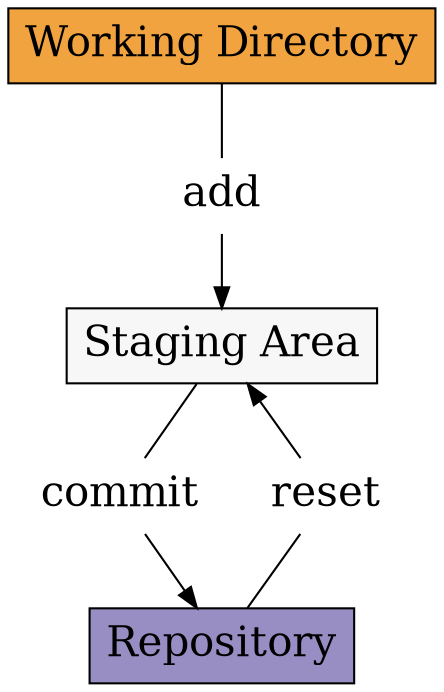

<section>
# Git

## Part 1
</section>

<section>
# Init

<section>
Первоначальная настройка **Git**

```shell
git config --global user.name "Nikolay Rozhkov"
git config --global user.email rozhkov@uchi.ru
```
</section>

<section>
Инициализировать новый проект c **Git**

```bash
git init new-project
```

Добавить существуй проект в **Git**

```bash
cd existing-project
git init
git init .
```
</section>
</section>

<section>
# Staging

<section>

</section>

<section>
## Add

```shell
git add .
```

## Reset
```shell
git reset
```
</section>

<section>
## Remove

```shell
git rm
git add -A
git add --all
```
</section>

<section>
## Save

```shell
git status
git commit
```

```shell
git commit -m 'Here goes message'
```
</section>

</section>

<section>
# Undo

Изменение последнего коммита

```shell
git commit --amend
```

Отмена изменений файла

```shell
git checkout -- hello.txt
```

</section>

<section>
# Branches

<section>
Список веток

```shell
$ git branch
* master
```


</section>

<section>
Создание ветки

```shell
git branch feature
```

Переключение

```shell
git checkout feature
```

Сокращённо

```shell
git checkout -b feature
```
</section>

<section>
Новая ветка


</section>

<section>
Разработка


</section>

<section>
Слияние **fast forward, "Перемотка"**

```shell
git checkout master
git merge feature
```


</section>

<section>
Слияние **--no-ff**

```shell
git checkout master
git merge --no-ff feature
```


</section>

<section>
Слияние при наличии других коммитов


</section>

</section>

<section>
# Git

## Part 2
</section>

<section>
# CHECKOUT

<section>
```
-b
--ours
--theirs
```
</section>

<section>
### Detached

```
git checkout 26c0aa12792e6344f5cc46718631f270b5fbb9b2
```
</section>
</section>

<section>
# Revisions

<section>


```bash
$ git show ???
```

</section>

<section>
Возможные значения

**master**

<p class="fragment">
**v1**
</p>

<p class="fragment">
**b1713c7**
</p>

<p class="fragment">
**b1713c7**
</p>
</section>

<section>
Возможные значения

HEAD**@{0}**

<p class="fragment">
HEAD**^**
</p>

<p class="fragment">
HEAD**~**
</p>

</section>

<section>
Выбираем **SHA**

```shell
$ git log
commit b1713c78427b728a2d981981dccb5d6e398b66a6
Author: Nikolay Rozhkov <rozhkov@uchi.ru>
Date:   Wed Jun 21 19:20:54 2017 +0300

    Fixed env

commit 47194bcc4a1413360b42a15f1067605162f58d29
Author: vbratkev <bratkevich.v@gmail.com>
Date:   Tue Jun 20 15:15:26 2017 +0300

    Fix deploy
```

</section>

<section>
Выбираем перемещения **HEAD**

```shell
$ git reflog
b1713c7 HEAD@{0}: commit: Fixed env
47194bc HEAD@{1}: clone: from git@github.com:uchiru/ansible-south-africa.git
```

```shell
$ git show HEAD@{1}
```

</section>

<section>
Выбираем **родителей**

`HEAD^n` **n-й родитель**

<p class="fragment">
`HEAD~n` **n 1-x родителей**
</p>

<p class="fragment">
`HEAD^1^1 == HEAD~2`
</p>
</section>

<section>
Выбираем **родителей**

`HEAD^ == HEAD^1`

`HEAD~ == HEAD~1`

`HEAD  == HEAD^0 == HEAD~0`
</section>

<section>
Выбираем родителей


</section>

<section>
Выбираем родителей


</section>
</section>

