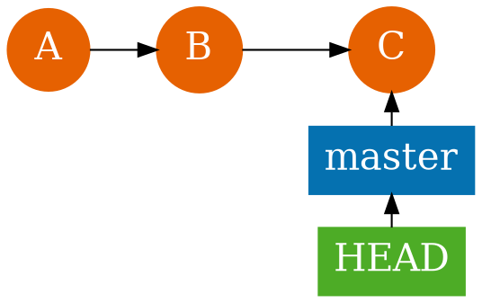
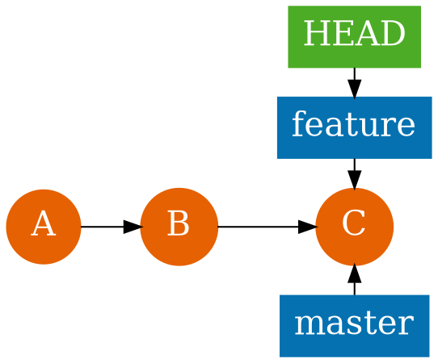
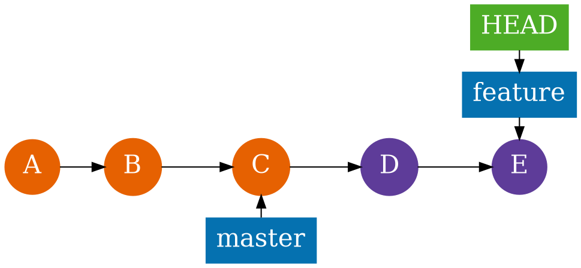
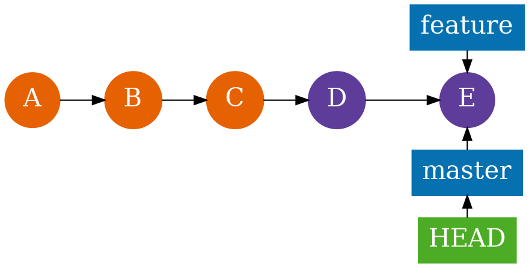
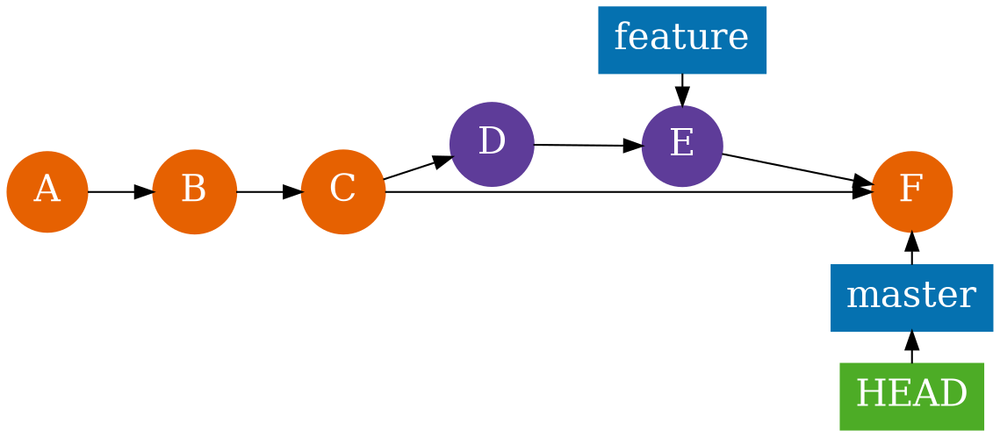
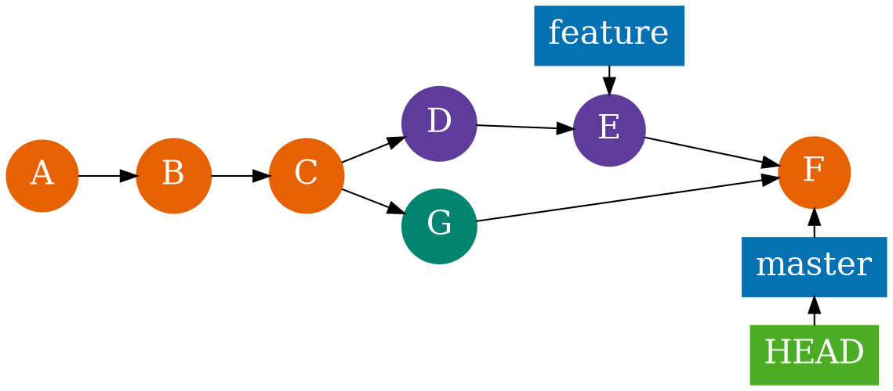

# Branches

<section>
Список веток

```shell
$ git branch
* master
```


</section>

<section>
Создание ветки

```shell
git branch feature
```

Переключение

```shell
git checkout feature
```

Сокращённо

```shell
git checkout -b feature
```
</section>

<section>
Новая ветка


</section>

<section>
Разработка


</section>

<section>
Слияние **fast-forward, "Перемотка"**

```shell
git checkout master
git merge feature
```


</section>

<section>
Слияние **--no-ff**

```shell
git checkout master
git merge --no-ff feature
```


</section>

<section>
Слияние при наличии других коммитов


</section>
