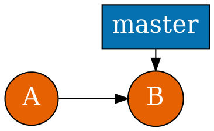
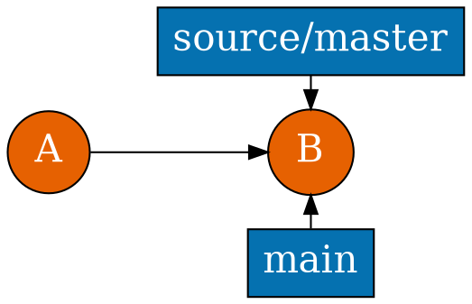
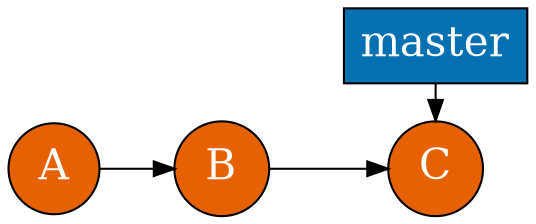
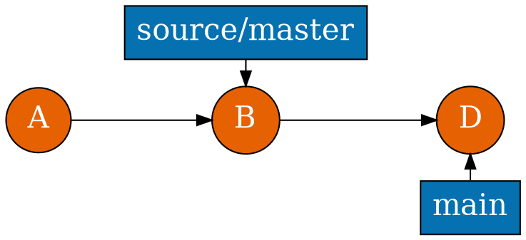
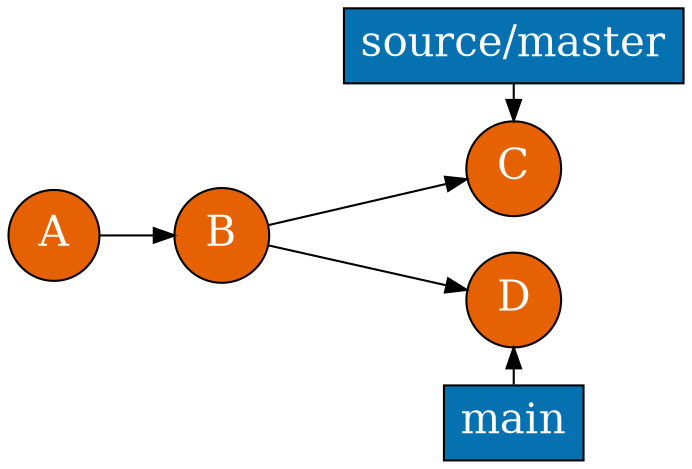
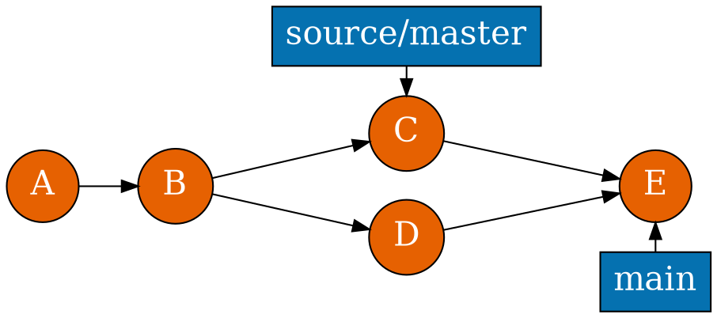

# Remotes

<section>

```shell
git init uchi && cd ..
```

<pre><code class="hljs nohighlight">git clone uchi<span class="fragment fade-up" data-fragment-index="0" style="color: #4dac26;"> -o source</span> local
cd local<span class="fragment fade-up" data-fragment-index="1" style="color: #5e3c99"> && git branch -m main</span>
<span class="fragment fade-up" data-fragment-index="2" style="color: #e66101">git br main --unset-upstream</span>
cat .git/config</code></pre>

<pre><code class="hljs nohighlight">[remote "<span class="fragment fade-out" data-fragment-index="0">origin</span><span class="fragment fade-up" data-fragment-index="0" style="color: #4dac26;">source</span>"]
  url = /tmp/uchi
  fetch = +refs/heads/*:refs/remotes/<span class="fragment fade-out" data-fragment-index="0">origin</span><span class="fragment fade-up" data-fragment-index="0" style="color: #4dac26;">source</span>/*
[branch "<span class="fragment fade-out" data-fragment-index="1">master</span><span class="fragment fade-up" data-fragment-index="1" style="color: #5e3c99">main</span>"]
  <span class="fragment fade-out" data-fragment-index="2">remote = <span class="fragment fade-out" data-fragment-index="0">origin</span><span class="fragment fade-up" data-fragment-index="0" style="color: #4dac26;">source</span>
  merge = refs/heads/master</code></pre></span>

</section>

<section>



```
git clone uchi -o source local
```


</section>

<section>



```shell
...
```


</section>

<section>


```shell
git fetch source
```


</section>


<section>


```shell
git fetch && git merge source/master
git pull source
```


</section>

<section>

```shell
source:destination
git push origin :topic
git push origin --delete topic
```

</section>