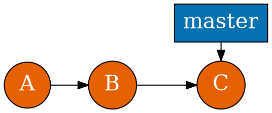
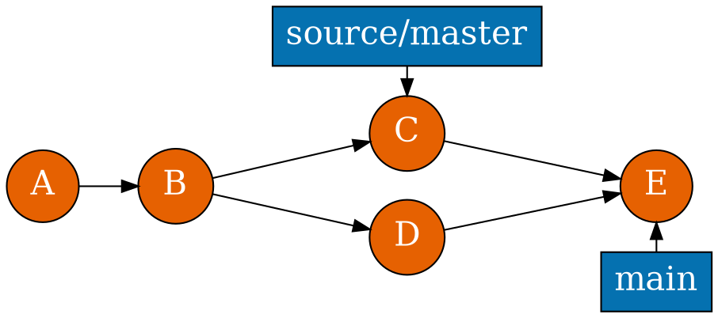
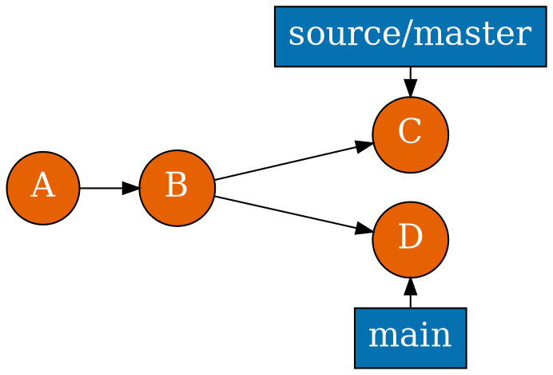
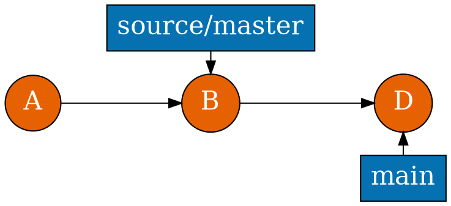
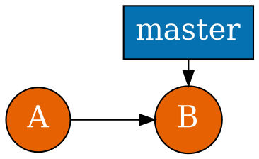
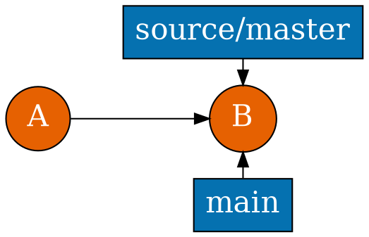

# Remotes

<section>

<pre><code class="hljs nohighlight">git init uchi
git clone uchi<span class="fragment fade-up" data-fragment-index="1" style="color: #329222;"> -o source</span> local
cd local <span class="fragment fade-up" data-fragment-index="1" style="color: #329222;">&& git branch -m main</span>
cat .git/config</code></pre>

```ini
[remote "source"]
  url = /tmp/uchi
  fetch = +refs/heads/*:refs/remotes/source/*
[branch "main"]
  remote = source
  merge = refs/heads/master
```
</section>

<section>



```shell
git merge source/master
git pull source
```


</section>

<section>


```shell
git fetch source
```


</section>

<section>


```shell
...
```


</section>

<section>



```
git clone uchi -o source local
```


</section>


<section>

```
$ git br main --unset-upstream
```

```
[remote "source"]
  url = /tmp/uchi
  fetch = +refs/heads/*:refs/remotes/source/*
[branch "main"]
```
</section>

<section>

```
origin/master
```

```
git clone -o custom
custom/master
```


```
git remote add origin git@github.com:uchiru/repo
```
</section>

<section>

```
source:destination
git push origin :topic
```

</section>