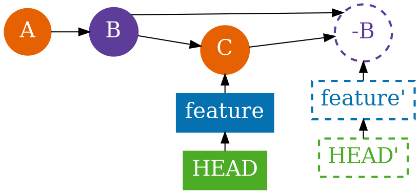
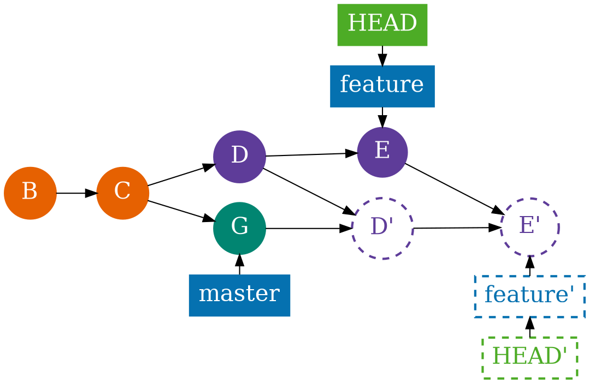
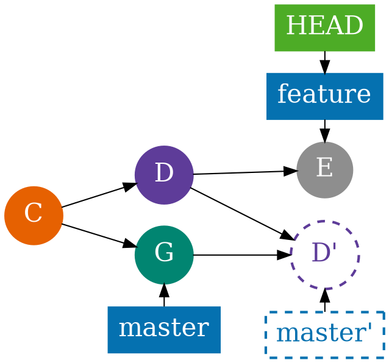

# Rewrite

<section>
**Revert**


```shell
git revert HEAD~1
```


</section>

<section>

```
git checkout feature && git rebase master
```


</section>

<section>
**Interactive Rebase**

```
git co -b before-rebase
for i in `seq 10 30`; do echo $i > $i && git add . && git cm -m$i ; done
git co -b after-rebase
git rebase -i HEAD~21 # master
```

```
# Rebase cc9a7b9..10cf5fa onto cc9a7b9 (21 command(s))
#
# Commands:
# p, pick = use commit
# r, reword = use commit, but edit the commit message
# e, edit = use commit, but stop for amending
# s, squash = use commit, but meld into previous commit
# f, fixup = like "squash", but discard this commit's log message
# x, exec = run command (the rest of the line) using shell
# d, drop = remove commit
```
</section>

<section>

```shell
git cherry-pick cc9a7b9
```


</section>