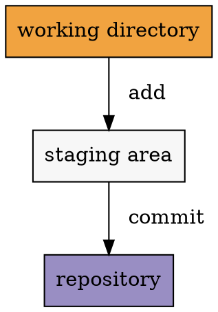

# Staging

<section>

```graphviz
digraph {
  labeljust="r"
  bgcolor="transparent"
  node[shape="rect" style="filled"]

  "working directory" -> "staging area" [label="   add"]
  "staging area" -> repository [label="   commit"]

  "working directory" [fillcolor="#f1a340"]
  "staging area"      [fillcolor="#f7f7f7"]
  repository          [fillcolor="#998ec3"]
}
```
</section>

<section>
## Add

```shell
git add .
```

## Reset
```shell
git reset
```
</section>


