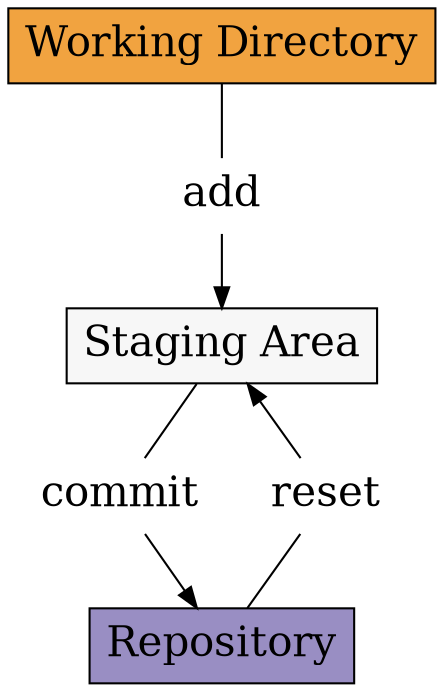

# Staging

<section>

</section>

<section>
## Add

```shell
git add .
```

## Reset
```shell
git reset
```
</section>

<section>
## Remove

```shell
git rm
git add -A
git add --all
```
</section>

<section>
## Save

```shell
git status
git commit
```

```shell
git commit -m 'Here goes message'
```
</section>
